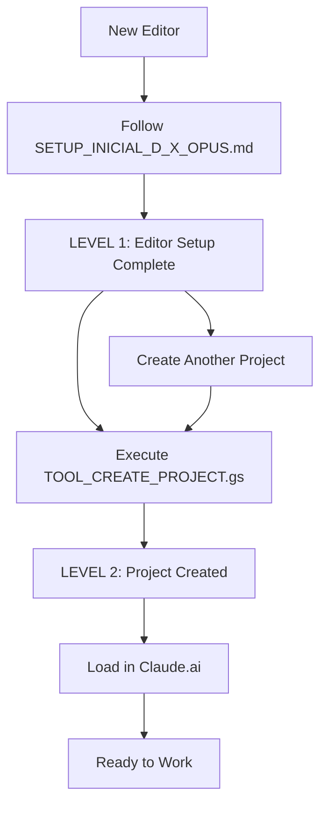

# D-X-OPUS Setup Tools

**Directory:** tools/  
**Purpose:** Automation tools for editor setup and project creation  
**Updated:** May 2026 (R1 Complete Implementation)  
**Status:** Operational

---

## Overview

This directory contains the automation tools that enable D-X-OPUS setup and operation. These tools implement the two-tier architecture: **LEVEL 1** (editor setup, once) and **LEVEL 2** (project creation, per project).

---

## Setup Architecture

### LEVEL 1: Editor Setup (One Time)
**Purpose:** Install and configure D-X-OPUS in the editor's environment  
**Time:** 45-60 minutes (one time per editor)  
**Result:** System ready to create projects in 2-3 minutes each

### LEVEL 2: Project Creation (Per Project)  
**Purpose:** Create specific projects ready for immediate use  
**Time:** 2-3 minutes per project  
**Result:** Project with full automation and prompts loaded

---

## Tools Inventory

| Tool | Level | Purpose | Usage |
|------|-------|---------|-------|
| **SETUP_INICIAL_D_X_OPUS.md** | 1 | Complete editor setup guide | Follow once per editor |
| **TOOL_CREATE_PROJECT.gs** | 1→2 | Automated project creation | Execute per project |

---

## SETUP_INICIAL_D_X_OPUS.md

**Complete setup guide for new editors using D-X-OPUS.**

### What It Covers
- **Google Drive structure** creation and organization
- **Google Apps Script** installation and configuration
- **EDITOR_PROFILE** creation and customization
- **EDITOR_CONFIG** personal configuration setup
- **Personal library** configuration for Activation workflow
- **Claude.ai template** project setup
- **Validation** and troubleshooting

### Key Features (v1.1)
- **Step-by-step process** with time estimates
- **Troubleshooting section** for common issues
- **Validation checkpoints** throughout setup
- **EDITOR_CONFIG integration** with auto-tracking
- **Multi-editor support** with personalization

### Usage
```bash
# 1. Download R1 package
# 2. Follow SETUP_INICIAL_D_X_OPUS.md step by step
# 3. Validate complete setup
# Result: D-X-OPUS operational
```

### Outputs Created
- Complete **D-X-OPUS/** folder structure in Drive
- Personal **EDITOR_CONFIG.md** with auto-tracking
- **EDITOR_PROFILE.md** with voice and style
- **Google Apps Script** project configured
- **Claude template** project ready for duplication
- **Personal library** ready for Activation

---

## TOOL_CREATE_PROJECT.gs

**Google Apps Script for automated project creation.**

### Core Functions

#### `createProject(projectCode, projectName, editorProfile)`
**Main function for creating new projects automatically.**

**Parameters:**
- `projectCode`: Short code for project (e.g., "TA", "ML")
- `projectName`: Full project name (e.g., "Bottom Up", "Machine Learning")
- `editorProfile`: Optional override of default editor profile

**What It Does:**
1. **Validates setup** is complete and functional
2. **Creates folder structure** in Drive automatically
3. **Generates PROJECT_README** using TEMPLATE_PROJECT_README
4. **Creates prompts package** ready for Claude.ai loading
5. **Generates project configuration** with auto-save settings
6. **Updates EDITOR_CONFIG** with new project tracking
7. **Provides next steps** for Claude.ai setup

**Example Usage:**
```javascript
// Create TA Bottom Up project
createProject("TA", "Bottom Up");

// Create project with specific profile
createProject("ML", "Machine Learning", "EDITOR_PROFILE_ANA_TORRES.md");
```

#### Supporting Functions

| Function | Purpose |
|----------|---------|
| `validateSetup()` | Ensures LEVEL 1 setup is complete before creating projects |
| `updateEditorConfig()` | Auto-updates editor's personal configuration with new project |
| `generateProjectReadme()` | Creates PROJECT_README from TEMPLATE_PROJECT_README |
| `generatePromptsPackage()` | Packages all essential prompts for Claude.ai loading |
| `generateProjectInstructions()` | Creates personalized Claude.ai project instructions |

#### Configuration and Testing

| Function | Purpose |
|----------|---------|
| `testSetup()` | Validates that LEVEL 1 setup is complete |
| `testConnection()` | Tests Google Drive API connectivity |
| `testCreateProject()` | Creates test project for validation |
| `getEditorStats()` | Reports editor's usage statistics |

### Key Features

#### **Template Integration**
- Uses **TEMPLATE_PROJECT_README** for consistent project documentation
- Uses **TEMPLATE_PROJECT_INSTRUCTIONS** for personalized Claude.ai setup
- Uses **TEMPLATE_EDITOR_CONFIG** patterns for auto-tracking

#### **Auto-Save Integration**
- Configures **AUTO_SAVE_CONFIG** for the project
- Sets up naming patterns: `{PROJECT_CODE}_{WORKFLOW}_{TYPE}_{ID}_v{VERSION}.md`
- Prepares **PROJECT_CONFIG** for auto-save functionality

#### **Multi-Editor Support**
- Detects available **EDITOR_PROFILEs** automatically
- Personalizes **project instructions** according to active profile
- Updates **EDITOR_CONFIG** with project tracking

#### **Error Handling**
- Validates setup before creating projects
- Provides clear error messages for common issues
- Includes rollback functionality for failed creations

### Installation and Configuration

#### **1. Install Google Apps Script**
```bash
# 1. Go to https://script.google.com
# 2. New Project
# 3. Paste TOOL_CREATE_PROJECT.gs content
# 4. Save as "D-X-OPUS Tools"
# 5. Authorize Google Drive permissions
```

#### **2. Configure for Your Setup**
```javascript
// Update CONFIG object at top of script:
const CONFIG = {
  DRIVE_ROOT: "D-X-OPUS",
  DEFAULT_EDITOR_PROFILE: "EDITOR_PROFILE_YOUR_NAME.md",
  // ... other settings
};
```

#### **3. Test Installation**
```javascript
// Run these functions in Apps Script editor:
testConnection()  // Should show "Connection to Google Drive successful"
testSetup()      // Should show "Setup valid - ready for projects"
```

### Usage Workflow

#### **Creating Your First Project**
```javascript
// 1. Ensure setup is complete
testSetup()

// 2. Create project
createProject("TEST", "Test Project")

// 3. Follow output instructions for Claude.ai setup
// 4. Validate project works correctly
// 5. Delete test project if desired
```

#### **Regular Project Creation**
```javascript
// Quick project creation (30 seconds)
createProject("PROJ", "Project Name")

// Result: Project ready for immediate use
```

### Output Structure

**Each project creation generates:**

```
[CODE]_[Project_Name]/
├── _discovery/           # Pre-workflow material
├── R_research/          # Research artifacts  
├── WB_writing_book/     # Book writing artifacts
├── WP_writing_post/     # Post writing artifacts
├── A_activation/        # Activation artifacts
├── config/              # Project configuration
├── PROJECT_README.md    # Project documentation
└── PROJECT_CONFIG.md    # Technical configuration
```

**Plus:**
- **PROMPTS_PACKAGE.md** ready for Claude.ai
- **Updated EDITOR_CONFIG** with project tracking
- **Next steps instructions** for Claude.ai setup

---

## Setup Process Flow

### Complete Workflow



### Time Investment

| Phase | Time | Frequency |
|-------|------|-----------|
| **LEVEL 1 Setup** | 45-60 min | Once per editor |
| **LEVEL 2 Project** | 2-3 min | Per project |
| **Claude.ai Config** | 2 min | Per project |
| **Total for First Project** | ~60 min | One time |
| **Each Additional Project** | ~5 min | Unlimited |

---

## Troubleshooting

### Common Issues

#### **Setup Errors**
- **Drive permissions:** Re-authorize Google Apps Script
- **Folder structure:** Verify D-X-OPUS/ exists with all subdirectories
- **Templates missing:** Ensure _system/templates/ contains all required templates

#### **Project Creation Errors**  
- **Invalid project code:** Use alphanumeric characters only
- **EDITOR_CONFIG not found:** Complete LEVEL 1 setup first
- **Template errors:** Check template variable formatting

#### **Auto-Update Issues**
- **EDITOR_CONFIG not updating:** Check write permissions in _editor/config/
- **Version conflicts:** Ensure templates are latest version

### Getting Help

1. **Run diagnostics:** `testSetup()` and `testConnection()`
2. **Check logs:** Google Apps Script execution transcript
3. **Verify setup:** Follow SETUP_INICIAL_D_X_OPUS.md validation steps
4. **Reset if needed:** Delete and recreate test project

---

## Development

### Adding Features

**Before modifying tools:**
1. Create DL entry documenting change rationale
2. Test with multiple editor configurations
3. Update this README with changes
4. Verify backward compatibility

### Testing

**Manual testing checklist:**
- [ ] `testSetup()` passes for clean installation
- [ ] `createProject()` succeeds for multiple project types
- [ ] Generated projects load correctly in Claude.ai
- [ ] EDITOR_CONFIG updates correctly
- [ ] Error handling works for invalid inputs

---

## Integration with System

### Dependencies
- **_system/templates/**: All template files must be present
- **_system/resources/**: AUTO_SAVE_CONFIG.yaml required
- **EDITOR_CONFIG.md**: Must exist in _editor/config/

### Outputs Used By
- **Claude.ai projects**: PROMPTS_PACKAGE and project instructions
- **Workflow prompts**: PROJECT_CONFIG for auto-save configuration  
- **Session management**: PROJECT_README for status tracking

---

**These tools enable the complete D-X-OPUS setup automation that makes R1 fully operational with minimal friction for editors.**
